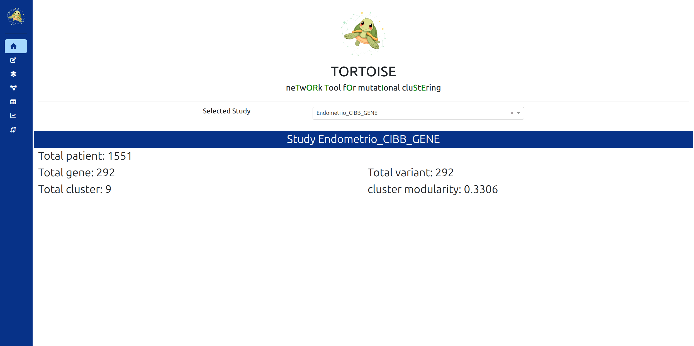
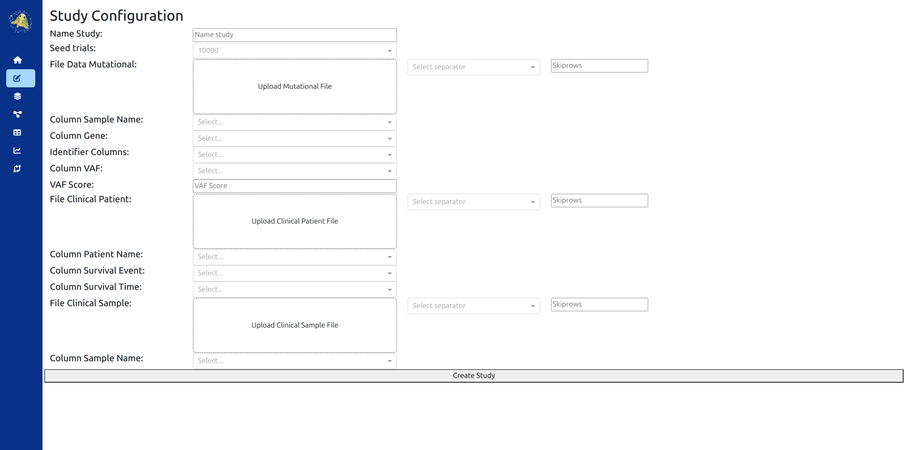
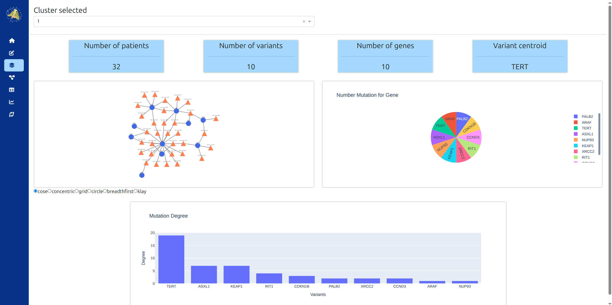
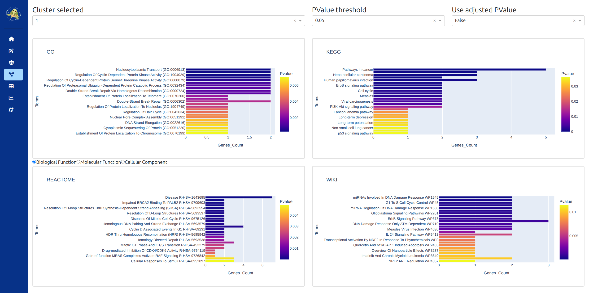
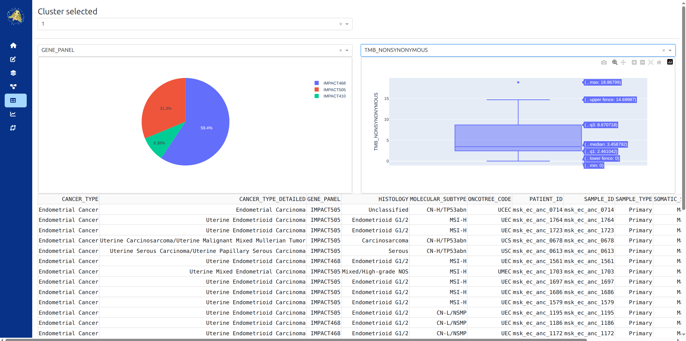
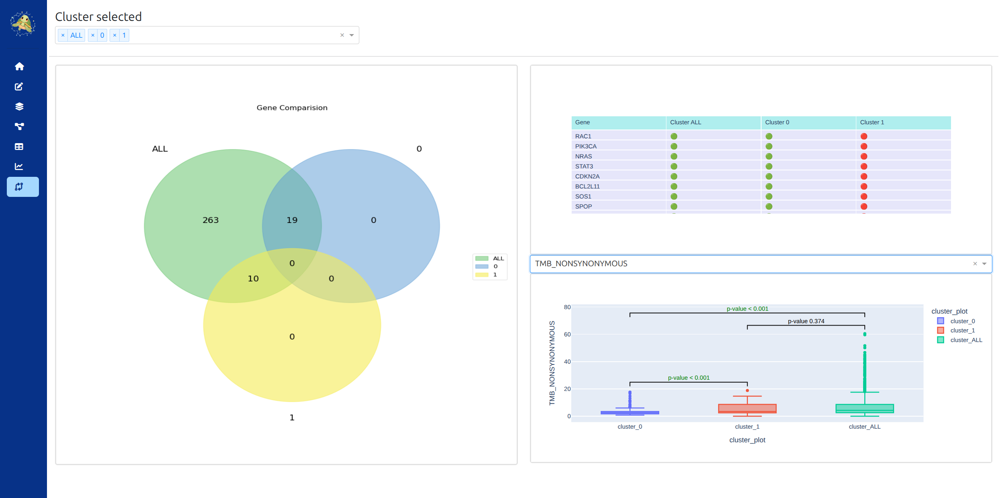

# 🧬 **TORTOISE** - ne<span style="color:lightgreen"><b>T</b></span>w<span style="color:lightgreen"><b>OR</b></span>k <span style="color:lightgreen"><b>T</b></span>ool f<span style="color:lightgreen"><b>O</b></span>r mutat<span style="color:lightgreen"><b>I</b></span>onal clu<span style="color:lightgreen"><b>S</b></span>t<span style="color:lightgreen"><b>E</b></span>ring
<p align="center"></p>

TORTOISE rapresents a bioinformatics tool that enables the construction of a bipartite graph from mutational data and the subsequent clustering of the constructed network. 
The tool allows for the analysis of the identified clusters and their visualization through a dedicated dashboard.

## Main Features ✨
🚀 Robust clustering with Leiden algorthm over 10.000 random seed to find the best modularity configuration <br>
 Interactive dashboard <br>
 Python-based implementation <br>
 Repoducibile computational environment managed by Conda <br>
 Docker containers for portability


## Installation and usage 📦

### 1. Conda

This script can be run in a Conda environment. To get started, create the environment by running the following command:

```bash
conda env create --file=environment.yaml
```

Once the environment has been created, it can be activated with the following comand:

```bash
conda activate tortoise
```

At this point, you can start the Tortoise instance with the command, and access the dashboard at <http://localhost:8593>

```bash
python main.py
```

⚠️ Conda environment is tested only on Windows and Linux. For other system, view Docker section.

### 2. Docker Build

Build docker image

```bash
docker build -t tortoise .
```

⚠️ For mac system use this comand

```bash
docker build --platform=linux/amd64 -t tortoise .
```

Run the image and access the dashboard at <http://localhost:8593>

```bash
docker run -p 8593:8593 --name tortoise tortoise
```

If you want to mount external study folder run

```bash
docker run -p 8593:8593 -v absolute_path_local_folder:/tortoise/study --name tortoise tortoise
```
## Dashboard Organizzation 📍

* [Home](#home)
* [Create study](#create-study)
* [Study description](#study-description)
* [Pathways analysis](#pathways-analysis)
* [Clinical data](#clinical-data)
* [Survival analysis](#survival-analysis)
* [Cluster comparison](#cluster-comparison)

---

### **Home**
In this page it's possibile to select a study, that has already been previously analysed through the tool, and is present into **study** folder



---

### **Create study**
In this page it's possibile to create a study, selecting the input files.



There are **2 principal sections**:

1. **Mutation Section** (**Obbligatory**): it's possibile to **upload** the file containing the mutations (maf, csv or txt extension), specifying the separator and the rows to be skipped before header. In the second part it's possibile specify the setting for mutational analysis.

   * through the **Seed trials** field you can select the random search iterations performed to find the best modularity result.

   * to identify mutations, you can select one or more columns in the **Identifier Columns** field, which will be used as the unique identifier of the mutation.
   
   * for the **VAF**, if you want to make a filter it's possibile to specify a threshold value into **VAF Score** and the name of the column for the VAF into **Column VAF**. In the event that such a threshold is chosen but vaf column isn't present in the dataset, it will be calculated according to the formula: **t_alt_count / t_alt_count + t_ref_count** and save into the column named "t_AF".
      >⚠️ Only values greater than or equal to the threshold will be considered.

2. **Clinical Section** (**Faculty**): it's possibile to upload the files containing clinical info. Two types of files containing the clinical data can be inserted: the **data clinical patient** and the **data clinical sample**, again specifying the separator, the rows to be skipped before the header and the identifier for the **patient** (data clinical  patient) and for the **sample** (data clinical sample)

**Once the [study](#study-structure) has been created, it can be selected on the homepage.**

---

### **Study description**
In this page it's possibile to visualize a summary for every cluster: number of patients, number of mutations and mutation centroid. It's also possibile visualize the plot of cluster graph, the number of mutation for each gene and the degree of mutation into the cluster.



---

### **Pathways analysis**
In this page it's possibile to visualize the enrichment analysis for every cluster. The database analyzed are: **GO**, **KEGG**, **REACTOME** and **Wikipathway**. it's also possibile to select the threshold for the p-value and if visualize the pathway that are significant for the adjusted p-value.

 

---

### **Clinical data**
In this page it's possibile to visualize the clinical parameters for every cluster.



---

### **Survival analysis**
If there are info about the vital status and OS months, in this page it's possibile to visualize the kaplan mayer curve for the cluster selected, a pie chart with the distribution for alive or death patient and a statistical comparison of survival between cluster.

---

### **Cluster comparison**
In this page it's possibile to make a comparison between cluster. For numerical parameter, a statistical test is performed to view if there are significant statistical difference.



## Study structure

```
study/
└─ STUDY_NAME/
   ├─ input/
   |  ├─ mutational_data.txt    # mutational data file
   |  ├─ clinical_sample.txt    # if loaded clinical sample file
   |  └─ clinical_patient.txt   # if loaded clinical patient file
   ├─ output/
   |  ├─ count_cluster_list/    # files with number of variants for each genes in the cluster
   |  |  ├─ count_cluster_0.csv
   |  |  ├─ count_cluster_1.csv
   |  |  └─ ...
   |  ├─ gene_cluster_list/     # files with a list of genes in the cluster 
   |  |  ├─ genes_cluster_0.csv
   |  |  ├─ genes_cluster_1.csv
   |  |  └─ ...
   |  ├─ pathway_analysis/
   |  |  ├─ GO/
   |  |  |  ├─ biological_0.csv # GO biological process enriched for genes's cluster
   |  |  |  ├─ biological_1.csv
   |  |  |  ├─ ...
   |  |  |  ├─ cellular_0.csv   # GO cellular component enriched for genes's cluster
   |  |  |  ├─ cellular_1.csv
   |  |  |  ├─ ...
   |  |  |  ├─ molecular_0.csv  # GO molecolar function enriched for genes's cluster
   |  |  |  ├─ molecular_1.csv
   |  |  |  └─ ...
   |  |  ├─ KEGG/               # kegg pathways enriched for genes's cluster
   |  |  |  ├─ kegg_0.csv
   |  |  |  ├─ kegg_1.csv
   |  |  |  └─ ...
   |  |  ├─ REACTOME/           # reactome pathways enriched for genes's cluster
   |  |  |  ├─ reactome_0.csv
   |  |  |  ├─ reactome_1.csv
   |  |  |  └─ ...
   |  |  └─ WIKI/               # wikipathway terms enriched for genes's cluster
   |  |     ├─ wiki_0.csv 
   |  |     ├─ wiki_1.csv
   |  |     └─ ...
   |  ├─ variants_degree/       # number of nodes connected to each variants for clusters 
   |  |  ├─ variants_degree_cluster_0.csv 
   |  |  ├─ variants_degree_cluster_1.csv
   |  |  └─ ...
   |  ├─ cluster_clinical_data.csv     # clinical data file with cluster column
   |  ├─ distribution_gene_cluster.csv # gene global percent presence in each cluster
   |  ├─ graph_cytoscape.graphml       # file graphml for cytoscape export
   |  ├─ graph.npy
   |  ├─ modularity.info               # file with modularity value
   |  ├─ mutation_centroids.csv        # file with the name of variant centroid for each cluster
   |  ├─ numerosity_cluster.csv        # file with number of patients and variants/genes for each cluster
   |  └─ summury_file.csv              # file with the name of variants and patients in each clusters
   └─ config.json               # study config
```

## Linting & Formatting 🔧

- This project uses [ruff](https://docs.astral.sh/ruff/) for code linting and formatting

- All Python code is also scanned with [bandit](https://bandit.readthedocs.io/en/latest/) to detect and prevent security vulnerabilities

## Contributing 🤝

Contributions are welcome! Please:

1. Fork the repository and create a feature branch
2. Keep changes focused; add tests when possible
3. Open a PR with a clear description and motivation
