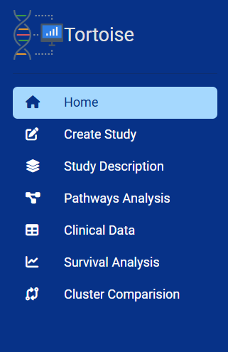
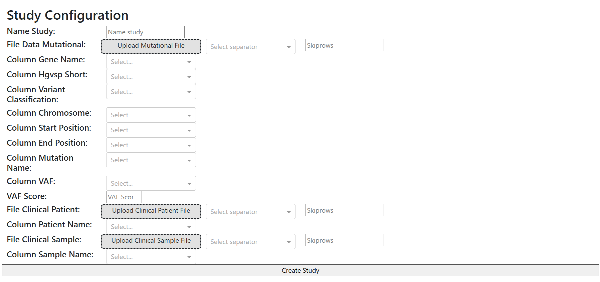

# 🧬 **TORTOISE**
ne**T**w**OR**k **T**ool f**O**r mutat**I**onal clu**S**t**E**ring

<p align="center">
  
</p>


This represents a bioinformatics tool that enables the construction of a bipartite graph from mutational data and the subsequent clustering of the constructed network. 
The tool allows for the analysis of the identified clusters and their visualization through a dedicated dashboard.

## Installation and usage

### Conda

This script can be run in a Conda environment. To get started, create the environment by running the following command:

```bash
conda env create -n tortoise --file=environment.yaml
```

Once the environment has been created, it can be activated with the following comand:

```bash
conda activate tortoise
```

At this point, the tortoise instance can be started by the command:

```bash
python main.py
```

⚠️Conda environment is tested only in Windows and Linux. For other system, view Docker section.
### Docker

Build docker image

```bash
docker build -t tortoise .
```
⚠️ For mac system use this comand
```bash
docker build --platform=linux/amd64 -t tortoise .
```

Run the image

```bash
docker run -p 8593:8593 --name tortoise tortoise
```

If you want to mount external Study folder run

```bash
docker run -p 8593:8593 -v local_folder:/tortoise/study --name tortoise tortoise
```

## Dashboard Organizzation
<div align="center">

</div>

* **Home**: In this page it's possibile to select a study, that has already been previously analysed through the tool, and is present into ***study** folder*
* **Create Study**: In this page it's possibile to select the input file. <br>
 <br>
There are 2 principale sections
    1. **Mutation Section** (**Obbligatory**): it's possibile to **upload** the file containing the mutations (maf, csv or txt extension), specifying the separator and the rows to be skipped. In the second part it's possibile specify the setting for mutational analysis.
        - if you have a specific column for mutation name, you can select the name into **Column Mutation Name**
        - if you want to use the variant categorisation system underlying the tool, you must specify the name of columns  that in your dataset correspond to: **Gene Name**, **HGVSp_Short**, **Variant Classification**, **Chromosome**, **Start Position**, **End Position**.
        - for the **VAF**, if you want to make a filter it's possibile to specify a threshold value into **VAF Score** and the name of the column for the VAF into **Column VAF**. In the event that such a threshold is chosen but vaf column isn't present in the dataset, it will be calculated according to the formula: **t_alt_count / t_alt_count + t_ref_count** and save into the column named "t_AF".
        ⚠️Only values greater than or equal to the threshold will be considered.

    2. **Clinical Section** (**Faculty**): it's possibile to upload the files containing clinical infos. Two types of files containing the clinical data can be inserted: the **data clinical patient** and the **data clinical sample**, again specifying the separator, the rows to be skipped and the identifier for the *patient* (data clinical  patient) and for the *sample* (data clinical sample)

    **Once the study has been created, it can be selected on the homepage**


* **Study Description**: In this page it's possibile to visualize a summary for every cluster: number of patients, number of mutations and mutation centroid. It's also possibile visualize the plot of cluster graph, the number of mutation for each gene and the degree of mutation into the cluster.

* **Pathways Analysis**: In this page it's possibile to visualize the enrichment analysis for every cluster. The database analyzed are: **GO**, **KEGG**, **REACTOME** and **Wikipathway**. it's also possibile to select the threshold for the p-value and if visualize the pathway that are significant for the adjusted p-value.

* **Clinical Data**: In this page it's possibile to visualize the clinical parameters for every cluster.

* **Survival Analysis**: if there are info about the vital status and OS months, in this page it's possibile to visualize the kaplan mayer curve for the cluster selected, a pie chart with the distribution for alive or death patient and a statistical comparison of survival between cluster.

* **Cluster Comparison**: In this page it's possibile to make a comparison between cluster. For numerical parameter, a statistical test is performed to view if there are significant statistical difference.
