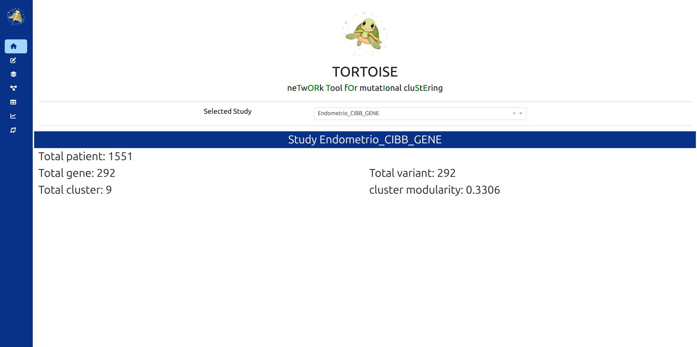
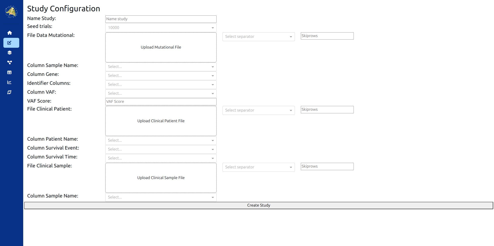
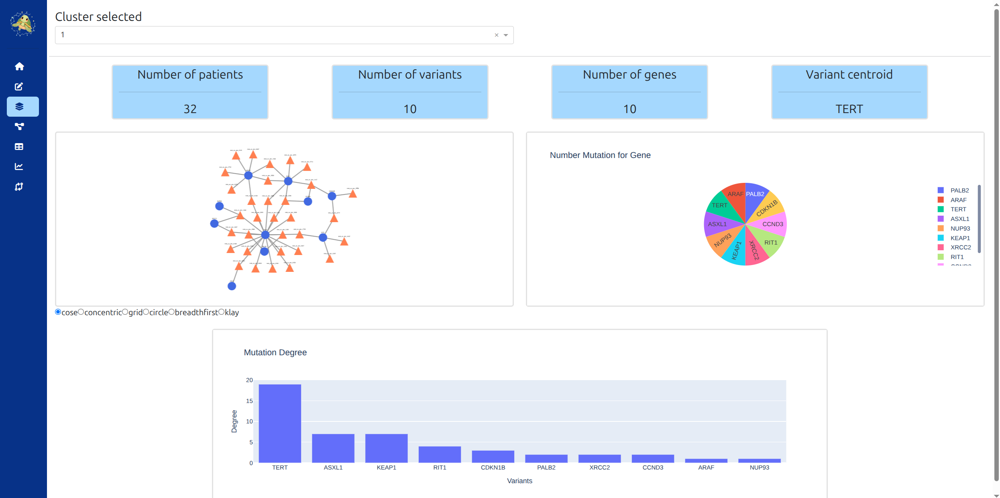
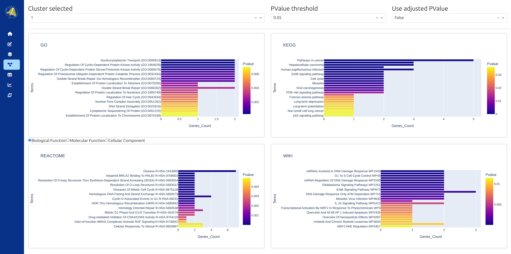
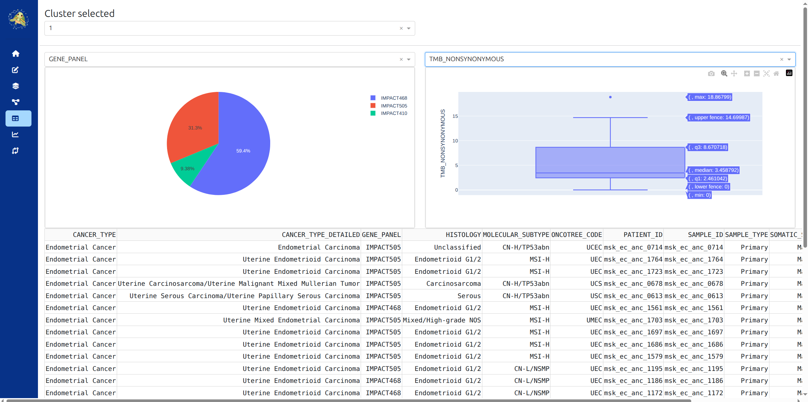
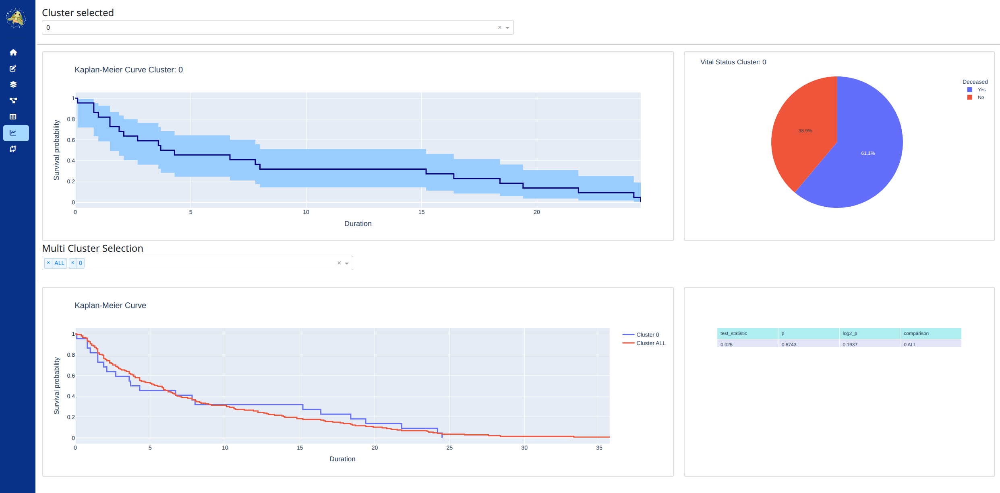
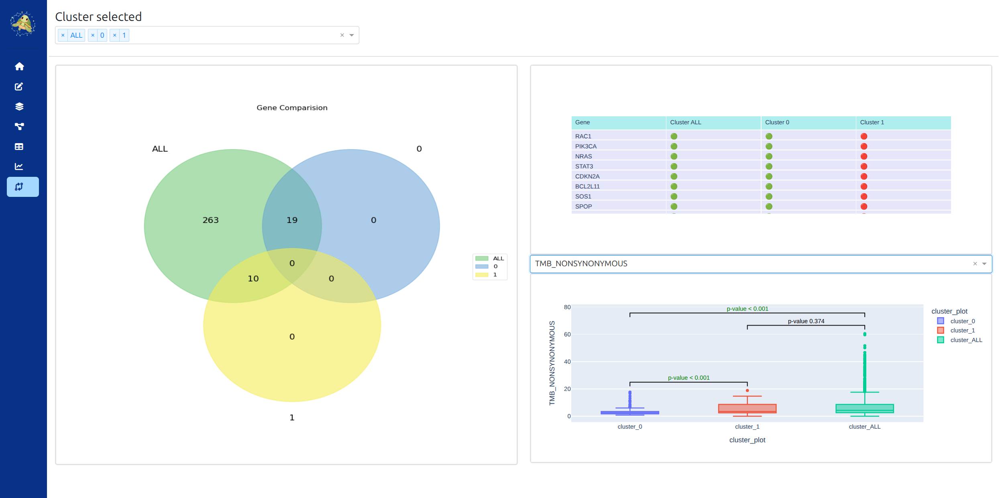

# 🧬 **TORTOISE** - ne<span style="color:lightgreen"><b>T</b></span>w<span style="color:lightgreen"><b>OR</b></span>k <span style="color:lightgreen"><b>T</b></span>ool f<span style="color:lightgreen"><b>O</b></span>r mutat<span style="color:lightgreen"><b>I</b></span>onal clu<span style="color:lightgreen"><b>S</b></span>t<span style="color:lightgreen"><b>E</b></span>ring
<p align="center"></p>

TORTOISE represents a bioinformatics tool that enables the construction of a bipartite graph from mutational data and the subsequent clustering of the constructed network. The tool allows for the analysis of the identified clusters and their visualization through a dedicated dashboard.

## Main Features ✨
🚀 Robust clustering with Leiden algorthm over 10.000 random seed to find the best modularity configuration <br>
 Interactive dashboard <br>
 Python-based implementation <br>
 Reproducibile computational environment managed by Conda <br>
 Docker containers for portability


## Installation and usage 📦

### 1. Conda

This script can be run in a Conda environment. To get started, create the environment by running the following command:

```bash
conda env create --file=environment.yaml
```

Once the environment has been created, it can be activated with the following command:

```bash
conda activate tortoise
```

At this point, you can start the Tortoise instance with the command, and access the dashboard at <http://localhost:8593>

```bash
python main.py
```
This Conda environment is tested and works on Windows, Linux, and macOS

### 2. Docker Build

Build docker image

```bash
docker build -t tortoise .
```


Run the image and access the dashboard at <http://localhost:8593>

```bash
docker run -p 8593:8593 --name tortoise tortoise
```


If you want to mount external study folder run

```bash
docker run -p 8593:8593 -v absolute_path_local_folder:/tortoise/study --name tortoise tortoise
```
To restart the tortoise container

```bash
docker restart tortoise
```
## Dashboard Organizzation 📍

* [Home](#home)
* [Create study](#create-study)
* [Study description](#study-description)
* [Pathways analysis](#pathways-analysis)
* [Clinical data](#clinical-data)
* [Survival analysis](#survival-analysis)
* [Cluster comparison](#cluster-comparison)

---

### **Home**
On the home page, it is possible to select a study that has already been analysed with the tool and is stored in the **study** folder



---

### **Create study**
On this page it's possibile to create a study, selecting the input files.



There are **2 principal sections**:

1. **Mutation Section** (**Required**): the tool allows the upload of the file containing the mutations (maf, csv or txt extension), specifying the separator and the rows to be skipped before the header.
   > ℹ️ **To create a maf file, starting from VCF, you can use [Varan](https://github.com/bioinformatics-policlinicogemelli/Varan) tool**

   In the second part, the user can specify the setting for mutational analysis.

   * through the **Seed trials** field you can select the random search iterations performed to find the best modularity result.

   * the **Clustering resolution** field allows you to set the clustering resolution between 0.01 and 2, with a default value of 1.

   * to identify mutations, you can select one or more columns in the **Identifier Columns** field, which will be used as the unique identifier of the mutation.
   
   * for the **VAF**, if you want to apply a filter, you can specify a threshold value in **VAF Score**and the name of the VAF column in **Column VAF**. If a threshold is set but the VAF column is not present in the dataset, it will be calculated using the formula: **t_alt_count / t_alt_count + t_ref_count** and saved into a column named "t_AF".
      >⚠️ Only values greater than or equal to the threshold will be considered.

2. **Clinical Section** (**Optional**) it is possible to upload the files containing the clinical information. Two types of files can be provided: **clinical data patient** and **clinical data sample**, specifying the separator, the number of rows to skip before the header, and the identifier for the **patient** (clinical data patient) or for the **sample** (clinical data sample).
   >⚠️ At the moment, the **Column Survival Event** must contain only `1` for deceased patients or `0`for living patients.

3. **CNV Section** (**Optional**) the user can upload the file containing the Copy Number Variations(maf, csv or txt extension), specifying the separator and the rows to be skipped before the header.

**Once the [study](#study-structure) has been created, it can be selected on the homepage.**

---

### **Study description**
On this page, it is possible to view a summary for each cluster: the number of patients, the number of mutations, and the mutation centroid. You can also view the cluster graph, the number of mutations for each gene, and the mutation degree within the cluster.



---

### **Pathways analysis**
On this page, you can view the enrichment analysis for each cluster. The databases used are **GO**, **KEGG**, **REACTOME** and **Wikipathway**. You can also set the p-value threshold and choose whether to display only the pathways that are significant after adjusted p-value correction.

 

---

### **Clinical data**
Here it's possibile to visualize the clinical parameters for every cluster.



---

### **Survival analysis**
If information about vital status and OS months is available, this page shows the Kaplan–Meier curve for the selected cluster, a pie chart displaying the distribution of alive and deceased patients, and a statistical comparison of survival between clusters.



---

### **Cluster comparison**
Here, you can compare the clusters. For numerical parameters, a statistical test is performed to assess whether there are significant differences.



## Study structure

```
study/
└─ STUDY_NAME/
   ├─ input/
   |  ├─ mutational_data.txt    # mutational data file
   |  ├─ clinical_sample.txt    # if loaded clinical sample file
   |  └─ clinical_patient.txt   # if loaded clinical patient file
   ├─ output/
   |  ├─ count_cluster_list/    # files with number of variants for each genes in the cluster
   |  |  ├─ count_cluster_0.csv
   |  |  ├─ count_cluster_1.csv
   |  |  └─ ...
   |  ├─ gene_cluster_list/     # files with a list of genes in the cluster 
   |  |  ├─ genes_cluster_0.csv
   |  |  ├─ genes_cluster_1.csv
   |  |  └─ ...
   |  ├─ pathway_analysis/
   |  |  ├─ GO/
   |  |  |  ├─ biological_0.csv # GO biological process enriched for genes's cluster
   |  |  |  ├─ biological_1.csv
   |  |  |  ├─ ...
   |  |  |  ├─ cellular_0.csv   # GO cellular component enriched for genes's cluster
   |  |  |  ├─ cellular_1.csv
   |  |  |  ├─ ...
   |  |  |  ├─ molecular_0.csv  # GO molecolar function enriched for genes's cluster
   |  |  |  ├─ molecular_1.csv
   |  |  |  └─ ...
   |  |  ├─ KEGG/               # kegg pathways enriched for genes's cluster
   |  |  |  ├─ kegg_0.csv
   |  |  |  ├─ kegg_1.csv
   |  |  |  └─ ...
   |  |  ├─ REACTOME/           # reactome pathways enriched for genes's cluster
   |  |  |  ├─ reactome_0.csv
   |  |  |  ├─ reactome_1.csv
   |  |  |  └─ ...
   |  |  └─ WIKI/               # wikipathway terms enriched for genes's cluster
   |  |     ├─ wiki_0.csv 
   |  |     ├─ wiki_1.csv
   |  |     └─ ...
   |  ├─ variants_degree/       # number of nodes connected to each variants for clusters 
   |  |  ├─ variants_degree_cluster_0.csv 
   |  |  ├─ variants_degree_cluster_1.csv
   |  |  └─ ...
   |  ├─ cluster_clinical_data.csv     # clinical data file with cluster column
   |  ├─ distribution_gene_cluster.csv # gene global percent presence in each cluster
   |  ├─ graph_cytoscape.graphml       # file graphml for cytoscape export
   |  ├─ graph.npy
   |  ├─ modularity.info               # file with modularity value
   |  ├─ mutation_centroids.csv        # file with the name of variant centroid for each cluster
   |  ├─ numerosity_cluster.csv        # file with number of patients and variants/genes for each cluster
   |  └─ summury_file.csv              # file with the name of variants and patients in each clusters
   └─ config.json               # study config
```

## Linting & Formatting 🔧

- This project uses [ruff](https://docs.astral.sh/ruff/) for code linting and formatting

- All Python code is also scanned with [bandit](https://bandit.readthedocs.io/en/latest/) to detect and prevent security vulnerabilities

## Contributing 🤝

Contributions are welcome! Please:

1. Fork the repository and create a feature branch
2. Keep changes focused; add tests when possible
3. Open a PR with a clear description and motivation
